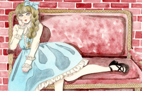
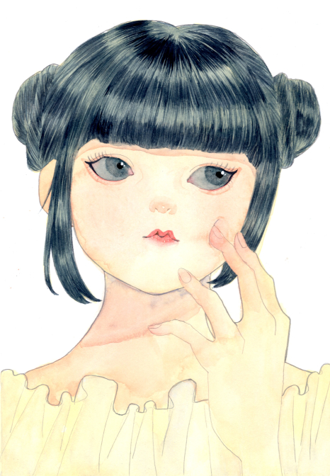
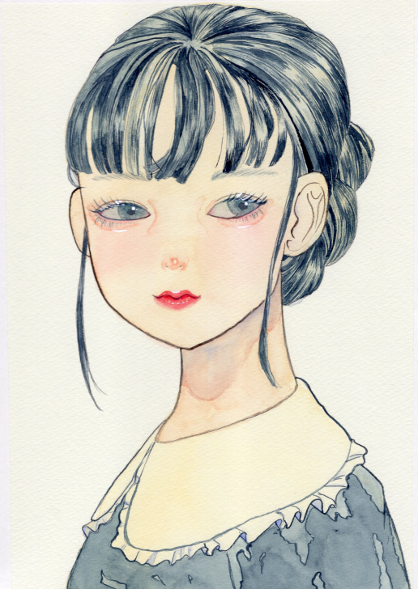

<link rel="stylesheet" href="css/styles.css">

<header>

[index](index.md)
[about](about.md)

</header>

<body>
# 自己ＰＲ
１つ目こんなことこんなことこんなことこんなことこんなことこんなこと
２つ目こんなことこんなことこんなことこんなことこんなことこんなこと
３つ目こんなことこんなことこんなことこんなことこんなことこんなこと

# 作品
主に水彩画で少女を描くことを得意としています

</body>
<footer>

</foooter>
